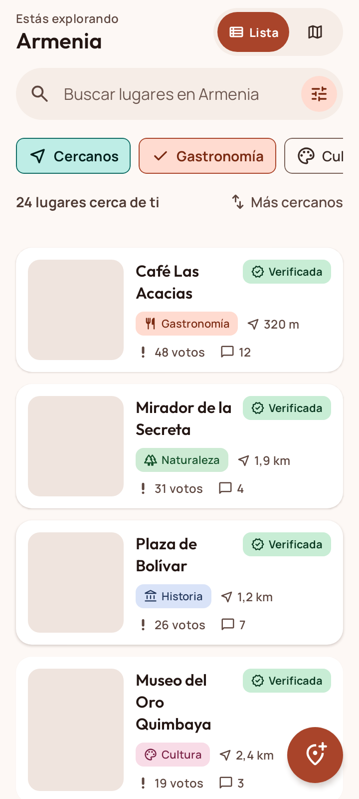
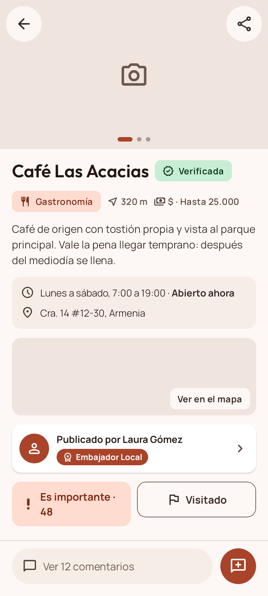
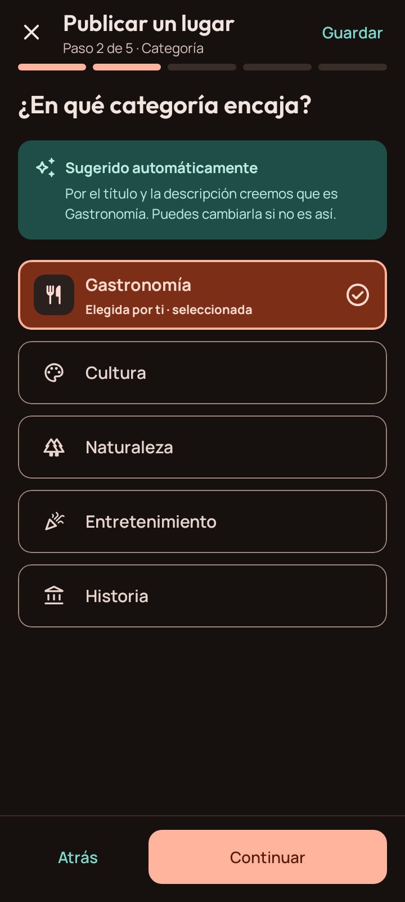
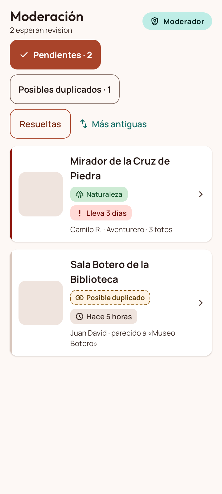
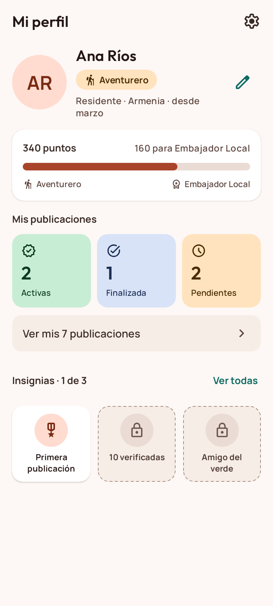
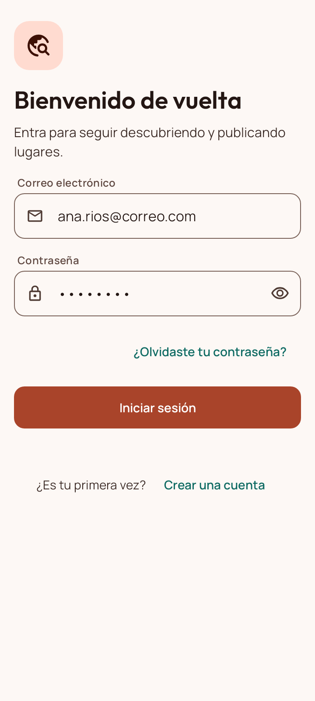
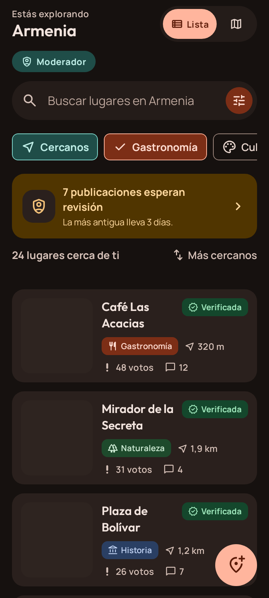
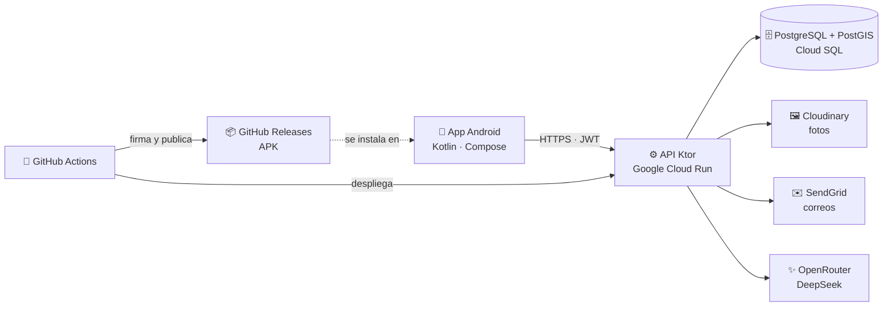

<p align="center">
  
</p>

<h1 align="center">ExploraCity</h1>

<p align="center">
  <b>Turismo colaborativo: descubre, publica y valida los lugares de tu ciudad.</b><br>
  Un proyecto de la Universidad del Quindío, en Armenia.
</p>

<p align="center">
  <a href="https://github.com/Dyze17/ExploraCity/releases/latest"></a>
  <a href="https://github.com/Dyze17/ExploraCity/actions/workflows/ci.yml"></a>
  <a href="https://github.com/Dyze17/ExploraCity/actions/workflows/deploy.yml"></a>
  
  
  
  
  
  
</p>

<p align="center">
  <a href="https://github.com/Dyze17/ExploraCity/releases/latest"></a>
</p>

Turistas y residentes **descubren, publican y validan puntos de interés (POI)** de su ciudad: cafés, museos, senderos, miradores, sitios históricos… Cada lugar que publica la comunidad pasa por un **moderador**, que lo verifica, lo rechaza con un motivo o lo da por finalizado. Así el mapa de la ciudad se mantiene confiable.

Es un monorepo con la **app Android** (Kotlin y Jetpack Compose) y su **API REST** (Ktor), desplegada en Google Cloud.

<table>
  <tr>
    <td align="center"><br><sub>Feed</sub></td>
    <td align="center"><br><sub>Detalle</sub></td>
    <td align="center"><br><sub>Publicar con IA</sub></td>
    <td align="center"><br><sub>Moderación</sub></td>
  </tr>
  <tr>
    <td align="center"><br><sub>Perfil e insignias</sub></td>
    <td align="center"><br><sub>Inicio de sesión</sub></td>
    <td align="center"><br><sub>Tema oscuro</sub></td>
    <td></td>
  </tr>
</table>

<sub>Las capturas salen de las vistas previas de Compose, con lugares de ejemplo de Armenia.</sub>

##  Instalar la app

1. Desde el teléfono, descarga `ExploraCity-1.0.0.apk` de la [última versión](https://github.com/Dyze17/ExploraCity/releases/latest).
2. Ábrelo. Android pide permitir la instalación de apps desde el navegador.
3. Crea tu cuenta. La app ya usa la API en la nube, así que no hace falta nada más.

Requiere **Android 9** o posterior. Las versiones nuevas se instalan encima de las anteriores.

## Qué hace

###  Explorar
- **Feed en lista y en mapa** (Google Maps), con marcadores agrupados y una tarjeta inferior para el lugar seleccionado. La lista se recarga deslizando hacia abajo.
- **Búsqueda y filtros**:
  - categorías;
  - «Cercanos» (5 km, con permiso de ubicación) o toda la ciudad;
  - «Solo verificados».

  La búsqueda ignora mayúsculas y tildes: «cafe» encuentra «Café».
- **Detalle del lugar**: fotos, descripción, horario («Abierto ahora»), rango de precio, ubicación, autor y estado de verificación.
- **Interacción**:
  - el voto «Es importante»;
  - «Marcar como visitado», con una experiencia opcional;
  - comentarios de hasta 300 caracteres, que se envían de forma optimista y se pueden reintentar.
- **Perfil público** de otras personas, con la opción de reportarlo.
- **Cuentas eliminadas**: sus lugares verificados, sus comentarios y los avisos que generaron siguen a la vista como «Usuario eliminado».

###  Publicar
- **Formulario en 5 pasos**:
  1. título y descripción;
  2. categoría, **sugerida por IA** (DeepSeek por OpenRouter, en menos de un segundo);
  3. ubicación en el mapa, con la dirección aproximada del pin;
  4. horario y rango de precio;
  5. de 1 a 5 fotos.
- **Posibles duplicados**: al confirmar la ubicación se buscan lugares con un nombre parecido a 50 m. La persona puede abrir el existente o confirmar que es otro lugar; en ese caso, el moderador ve la marca «posible duplicado».
- **Borrador persistente**: sobrevive a la rotación, al cierre de la app y a la falta de conexión. Un envío sin red queda en la cola y sale solo al volver la conexión.
- **Mis publicaciones**, con filtros por estado. Desde ahí se puede:
  - editar o eliminar una publicación;
  - ver el motivo de un rechazo;
  - «Corregir y reenviar», con lo que hay que revisar según el motivo.

###  Social y reputación
- **Notificaciones** dentro de la app (sin push): comentarios, verificación, rechazo, rechazo por duplicado, logros y publicaciones finalizadas.
- **Puntos**:
  - +20 por la primera publicación;
  - +15 cuando se verifica;
  - +5 por la primera visita a un lugar.
- **Niveles**: Recién llegado, Explorador, Aventurero y Embajador Local.
- **Insignias** con su progreso. Al desbloquear una llega un aviso de logro.

###  Moderación
- Una 5.ª pestaña **«Moderación»** aparece solo con el rol Moderador, dentro de la misma app. Su insignia cuenta las publicaciones pendientes.
- **Cola de pendientes**, de la más antigua a la más reciente, con su urgencia y el filtro «Posibles duplicados». Sin conexión muestra la última cola guardada, solo para leer.
- **Revisión** con las fotos a pantalla completa, todos los datos, el mapa y la ficha del autor.
- **Comparar un posible duplicado** con el lugar existente: los dos lado a lado y la distancia entre ellos en el mapa.
- **Decisiones**:
  - verificar, con una nota interna opcional;
  - rechazar con un motivo;
  - finalizar o devolver a pendiente.

  Cada decisión notifica al autor y abre la siguiente pendiente.
- **Resueltas**: lo ya decidido, con su motivo y su nota. Con la cola vacía, un resumen del trabajo del día.
- Un moderador nunca decide sus propias publicaciones: las revisa otro.

###  Acceso y cuenta
- **Arranque**: la primera vez va al onboarding de tres paneles; con una sesión guardada, entra directo al feed. Si la red falla, se puede seguir sin conexión con lo guardado.
- **Registro**: pide la autorización de tratamiento de datos (**Ley 1581 de 2012**), que nunca viene marcada.
- **Inicio de sesión**:
  - no revela cuál de los dos datos falló;
  - tras 5 intentos fallidos con el mismo correo, pide esperar 15 minutos;
  - si la sesión vence, avisa «Tu sesión terminó. Vuelve a entrar.».
- **Recuperación de contraseña**: el enlace del correo **abre directo la app** en «Nueva contraseña» (App Links). Vence a los 30 minutos y se puede reenviar después de 60 s. La app nunca revela si un correo tiene cuenta.
- **Editar perfil**: foto, nombre, «Sobre mí» y «De visita» o «Residente».
- **Ajustes**: tema claro, oscuro o del sistema; documentos legales; **descargar mis datos** en JSON; cerrar sesión.
- **Cambiar correo**: pide la contraseña y se confirma con un enlace en el correo nuevo.
- **Eliminar la cuenta**: muestra qué se borra y qué se conserva de forma anónima, y pide escribir **ELIMINAR**.

###  Correos
La bienvenida, la recuperación de contraseña y el cambio de correo llegan con el diseño de la app:
- una tarjeta con «ExploraCity» en el color principal;
- el enlace como **botón**, y también a la vista;
- un pie que explica por qué llegó el correo.

Se envían con SendGrid.

###  Sin conexión, accesibilidad y tema
- **Sin conexión**:
  - el feed y el detalle de cada lugar quedan guardados en Room, con la antigüedad de la copia;
  - las visitas, los votos y los comentarios hechos sin red quedan en una **cola de envío** que WorkManager envía al volver la conexión.
- **Accesibilidad**:
  - el estado nunca se muestra solo con color;
  - el contraste es de al menos 4,5:1 en los dos temas;
  - todo funciona con TalkBack;
  - el diseño se adapta con la **fuente al 200 %**.
- **Tema** claro y oscuro con Material 3. Las tipografías son Outfit y Manrope.

| Categorías | Estados de una publicación |
|---|---|
| Gastronomía · Cultura · Naturaleza · Entretenimiento · Historia | **Pendiente** → **Verificada** o **Rechazada** → **Finalizada**. Editar una publicación la devuelve a Pendiente. |

##  Estado del proyecto

**Versión 1.0.0, publicada.**
- Todas las pantallas del diseño están implementadas.
- La app trabaja con la API desplegada en Google Cloud, sin datos de ejemplo.
- La ciudad es **Armenia**; se cambia en `api-ktor/src/main/resources/application.conf`.

| Área | Pantallas (numeración del diseño) | Estado |
|---|---|---|
| Acceso (splash, onboarding, inicio de sesión, registro y recuperación) | 1–6, 6C | ✅ |
| Explorar | 7–14, 31 | ✅ |
| Publicar y mis publicaciones | 15–24 | ✅ |
| Notificaciones, perfil e insignias | 25–27 | ✅ |
| Editar perfil, ajustes, documentos legales y eliminar cuenta | 28–30, 29A, 4A | ✅ |
| Cambiar correo (Ajustes › Cuenta) | sin número | ✅ |
| Moderación y «Resueltas» | 32–37, 33A | ✅ |
| API ([contrato](docs/api/README.md)) | — | ✅ |
| Despliegue: la API en Cloud Run y la app en GitHub Releases ([guía](docs/despliegue.md)) | — | ✅ |

**Pendiente:**
- La API todavía no recibe reportes de lugares, así que la revisión de una pendiente (33) no muestra ninguno.
- **Próximo:** entrar y registrarse con una cuenta de Google.

##  Arquitectura

La arquitectura sigue el documento de arquitectura del software (modelo C4, v1.1) y sus decisiones arquitectónicas (ADR).



```
.
├── app-android/          App Android (proyecto Gradle, módulo app/)
├── api-ktor/             API REST en Ktor
├── docs/                 Modelo C4, arquitectura, decisiones, contrato de la API y despliegue
├── .github/              CI y despliegue (GitHub Actions) y plantilla de pull request
└── CONTRIBUTING.md       Flujo de ramas, commits y pull requests
```

### App Android (`app-android/`)

Paquete `co.edu.uniquindio.exploracity`, organizado por capas:

| Paquete | Contenido |
|---|---|
| `ui/` | Pantallas Compose, componentes del sistema de diseño y tema Material 3 |
| `navigation/` | Navegación con rutas tipadas, una barra inferior según el rol y los enlaces del correo |
| `viewmodel/` | Estado de la UI con `StateFlow` |
| `data/remote` | Cliente de la API (Ktor Client, DTO) y sesión que renueva el token con un 401 |
| `data/local` | Sesión (rol, tokens y cuenta) y preferencias en DataStore, caché sin conexión en Room |
| `data/repository` | Repositorios `Api*` sobre la API. Los envoltorios `Offline*` guardan una copia para usar sin conexión, y los `OnlineOnly*` ni lo intentan sin red |
| `data/sync` | Cola de envío sin conexión con WorkManager |
| `data/connectivity`, `data/location`, `data/photos` | Estado de la red; ubicación del teléfono y geocodificación; fotos |
| `domain/` | Modelos del dominio |
| `util/` | Formateadores y permisos |

**Stack:**
- Kotlin 2.4, Jetpack Compose (BOM 2026.09) y Material 3.
- Navigation Compose, Lifecycle/ViewModel y Coroutines.
- Ktor Client (OkHttp) y kotlinx.serialization.
- DataStore, Room y WorkManager.
- Maps Compose y Play Services Location.
- `minSdk 28`; `targetSdk` y `compileSdk 37`.

**Pruebas:**
- JUnit, kotlinx-coroutines-test, Robolectric y Compose UI Test.
- `ThemeContrastTest` exige el contraste mínimo de cada par de colores del tema.
- Los clientes de la API se prueban con el `MockEngine` de Ktor y los ejemplos del contrato (`docs/api/ejemplos`), los mismos que comprueba `api-ktor`.

### API (`api-ktor/`)

Paquetes `routes/`, `service/`, `repository/`, `model/`, `integration/`, `config/` y `plugins/`.

**Stack:**
- Ktor 3.6 (Netty) con autenticación JWT.
- Exposed y HikariCP sobre PostgreSQL con **PostGIS** y **pg_trgm**, con las migraciones de Flyway.
- BCrypt para las contraseñas.
- Integraciones con Ktor Client:
  - Cloudinary, para las fotos;
  - SendGrid, para los correos;
  - OpenRouter, con DeepSeek V4.1 Flash, para la sugerencia de categoría.

La IA y la detección de duplicados corren en el backend, así que ninguna clave viaja en la app.

**Seguridad de la sesión:**
- Las contraseñas se guardan con BCrypt de costo 12.
- La sesión usa un JWT de acceso de 15 minutos y un token de renovación de 30 días.
  - El token de renovación cambia en cada uso, y solo se guarda su hash.
  - Si llega uno que ya se usó, se cierran todas las sesiones de la cuenta.
- Tras 5 intentos fallidos en 15 minutos con el mismo correo, el inicio de sesión queda bloqueado 15 minutos.

**Búsqueda:** el feed, el mapa y el perfil público ordenan por cercanía con PostGIS. Miden desde la ubicación de la persona o, sin ella, desde el centro de la ciudad.

**Reputación:**
- Votar o visitar un lugar propio no suma ni puntos ni avance de insignias.
- Una insignia no se pierde aunque la cifra baje después.
- Los +20 de la primera publicación se pierden si se elimina o si la rechazan sin permitir que se reenvíe.
- Los +15 de la verificación se dan solo la primera vez.

**Publicar y moderar:**
- Las fotos se suben antes del envío. Repetir un envío que ya llegó, por ejemplo desde la cola sin conexión, no lo duplica.
- Los lugares parecidos se buscan a 50 m con PostGIS y pg_trgm, nunca entre las pendientes de otras personas.
- Si dos moderadores deciden a la vez, el segundo recibe un aviso de que ya está decidida.

**Integraciones:** cada una tiene una versión real y otra de desarrollo. La real se activa cuando su clave está en `api-ktor/.env`.
- Sin SendGrid, los correos quedan en un buzón en memoria.
- Sin Cloudinary, las fotos van a `api-ktor/media/`.
- Sin OpenRouter, la categoría se sugiere por palabras clave.

**En Cloud Run** (`APP_ENV=production`):
- La API no arranca sin SendGrid ni Cloudinary, ni con el buzón de desarrollo.
- Los enlaces del correo son https (`…run.app/enlace/restablecer?token=…`). En el navegador abren una página con el botón «Abrir en ExploraCity».
- Con la huella de la firma de la app, la API publica `/.well-known/assetlinks.json`, y Android abre los enlaces directo en la app (App Links).

El contrato con la app, con sus endpoints, códigos de error y ejemplos, está en [`docs/api/`](docs/api/README.md).

**Pruebas:** JUnit con `testApplication` de Ktor y PostGIS real con Testcontainers.

##  Cómo ejecutar

### Requisitos
- **JDK 25**
- **Android Studio 2026.1.3** o posterior (el proyecto usa AGP 9.4) y el **Android SDK 37**
- **Docker Desktop**, para la base de datos de la API.
- Una clave de **Google Maps**, para ver el mapa. Tiene que aceptar el paquete `co.edu.uniquindio.exploracity.debug` con la huella de depuración de tu equipo ([guía](docs/despliegue.md)). Sin ella, la pantalla del mapa muestra un aviso de desarrollo.

### App Android

La versión de depuración es **«ExploraCity (dev)»** (`co.edu.uniquindio.exploracity.debug`). Convive en el teléfono con la de producción, y cada una guarda sus propios datos. Necesita la API en marcha: primero sigue los pasos de [API](#api).

Agrega la clave de Maps a `app-android/local.properties`. Ese archivo está fuera de git:

```properties
MAPS_API_KEY=tu_clave
# Opcional: la dirección de la API para la versión de depuración. Por omisión, http://localhost:8080/
API_BASE_URL=http://localhost:8080/
```

Con el teléfono por USB, deja `API_BASE_URL` como viene y reenvía el puerto de la API al equipo. En el emulador funciona igual:

```bash
adb reverse tcp:8080 tcp:8080
```

El reenvío se pierde al desconectar el teléfono o al activar el modo avión, y hay que repetirlo. Si prefieres la red local, pon la IP del equipo (`http://192.168.x.x:8080/`) en `API_BASE_URL` y en `PUBLIC_BASE_URL` de la API.

Con `API_BASE_URL=https://exploracity-api-31949725643.us-east1.run.app/`, la versión de depuración usa la API de producción, con correos, fotos e IA reales. Ahí no existe el buzón de desarrollo.

Las compilaciones de depuración pueden usar HTTP, para la API del equipo. La de producción solo acepta HTTPS y siempre usa la API de Cloud Run.

Compila, prueba y revisa:

```bash
cd app-android
./gradlew assembleDebug
./gradlew testDebugUnitTest lintDebug
```

`./gradlew assembleRelease` compila la de producción sin firma; la firma solo existe en GitHub Actions ([«Publicar una versión de la app»](docs/despliegue.md#publicar-una-versión-de-la-app)). En Windows usa `gradlew.bat`. También puedes abrir `app-android/` en Android Studio y ejecutar la configuración `app`.

#### Herramientas de desarrollo

Estas opciones solo aparecen en las compilaciones de depuración:

- **Correo de prueba**: aparece en «Revisa tu correo» (6.a) y en «Confirma tu correo nuevo». Lee el buzón de desarrollo de la API, así que necesita `DEV_MAILBOX=true`.
  - «Abrir el enlace del correo» hace lo que haría el enlace real: abre «Nueva contraseña» (6.b) o confirma el correo nuevo.
  - «Abrir un enlace vencido» lleva a la pantalla de enlace vencido.
- **Muestrario del sistema de diseño**: un acceso desde Ajustes.

No hay cuentas de prueba: se crean en el registro de la app, contra la API. Una cuenta con uno de los correos de `MODERATOR_EMAILS` tiene la pestaña «Moderación». Si la lista cambia, el rol se pone al día al reiniciar la API, y la app lo ve al volver a entrar.

Desde la API del equipo, los enlaces de los correos son `exploracity://enlace/restablecer?token=…` y `exploracity://enlace/confirmar-correo?token=…`. Sin el botón de prueba, también se pueden abrir con `adb`. El paquete del final evita que Android pregunte qué app usar cuando la de producción también está instalada:

```bash
adb shell am start -a android.intent.action.VIEW -d "exploracity://enlace/restablecer?token=..." co.edu.uniquindio.exploracity.debug
```

### API

Necesita **Docker Desktop**, que levanta PostgreSQL 16 con PostGIS.

1. Copia `api-ktor/.env.example` como `api-ktor/.env`, que está fuera de git. Completa la contraseña de la base de datos, la clave del JWT y los correos de moderador. Ningún valor puede llevar `$`, porque Docker Compose lo toma como una variable.

   Las demás variables son opcionales:
   - `DEV_MAILBOX=true` abre `/v1/dev/mailbox`, el buzón de desarrollo que leen los botones de «Correo de prueba». Nunca va en producción.
   - `SENDGRID_API_KEY` y `MAIL_FROM` envían los correos de verdad.
   - `CLOUDINARY_CLOUD_NAME`, `CLOUDINARY_API_KEY` y `CLOUDINARY_API_SECRET`, las tres juntas, suben las fotos a Cloudinary.
   - `OPENROUTER_API_KEY` sugiere la categoría con IA. `OPENROUTER_MODEL` cambia el modelo; sin él, `deepseek/deepseek-v4.1-flash`, con el razonamiento apagado para que responda en menos de 1 s.
   - `PUBLIC_BASE_URL` es el comienzo de las direcciones de la carpeta local. Por omisión, `http://localhost:8080`, que también sirve en el teléfono con `adb reverse`.
2. Levanta la base de datos y la API:

```bash
cd api-ktor
docker compose up -d   # PostGIS en localhost:5432
./gradlew run          # http://localhost:8080/health; aplica las migraciones al arrancar
```

Las pruebas crean su propia base de datos con Testcontainers. Sin Docker, las que la necesitan se omiten en el equipo, pero en el CI siempre corren:

```bash
./gradlew test buildFatJar
```

La imagen de la API, con Docker:

```bash
docker build -t exploracity-api api-ktor
```

### Desplegar

[`docs/despliegue.md`](docs/despliegue.md) configura Google Cloud desde cero: Cloud Run, Cloud SQL, Secret Manager, Artifact Registry y el acceso de GitHub sin claves. También explica cómo publicar una versión de la app: el keystore, los secretos y la etiqueta `vX.Y.Z`.

##  Integración continua y entrega

| Flujo | Cuándo corre | Qué hace |
|---|---|---|
| [`ci.yml`](.github/workflows/ci.yml) | Cada pull request y cada push a `main` | Compila las dos versiones de la app y corre las pruebas de la app y de la API |
| [`deploy.yml`](.github/workflows/deploy.yml) | Cada push a `main` que cambie `api-ktor/` | Corre las pruebas, sube la imagen a Artifact Registry, la despliega en Cloud Run y comprueba `/health`. Entra a Google Cloud con Workload Identity Federation |
| [`release.yml`](.github/workflows/release.yml) | Cada etiqueta `vX.Y.Z`, o a mano | Firma el APK, comprueba la huella de los App Links y lo publica en GitHub Releases. A mano, deja un APK de prueba |

`main` está protegida. Todo cambio entra por pull request con el CI en verde.

##  Contribuir

El flujo de ramas, el formato de los commits y la lista de revisión antes de abrir un pull request están en [CONTRIBUTING.md](CONTRIBUTING.md).

##  Recursos de terceros

Las fuentes Outfit y Manrope (SIL Open Font License 1.1) y los iconos Material Symbols Rounded (Apache 2.0) se detallan en [app-android/THIRD_PARTY_NOTICES.md](app-android/THIRD_PARTY_NOTICES.md). Los íconos de este README son esos mismos Material Symbols. Las insignias de la cabecera son de [Shields.io](https://shields.io).
